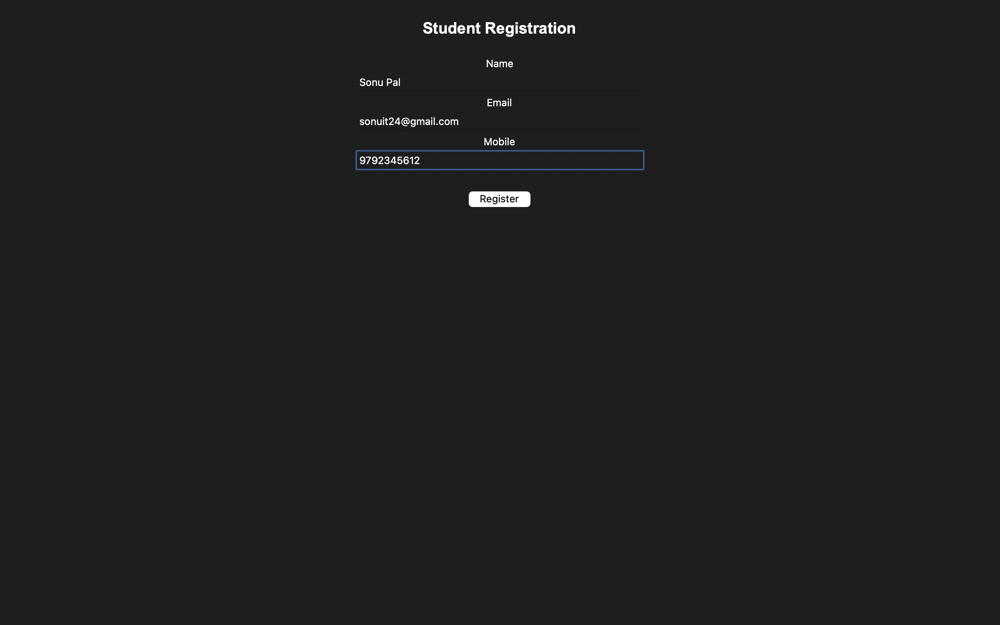
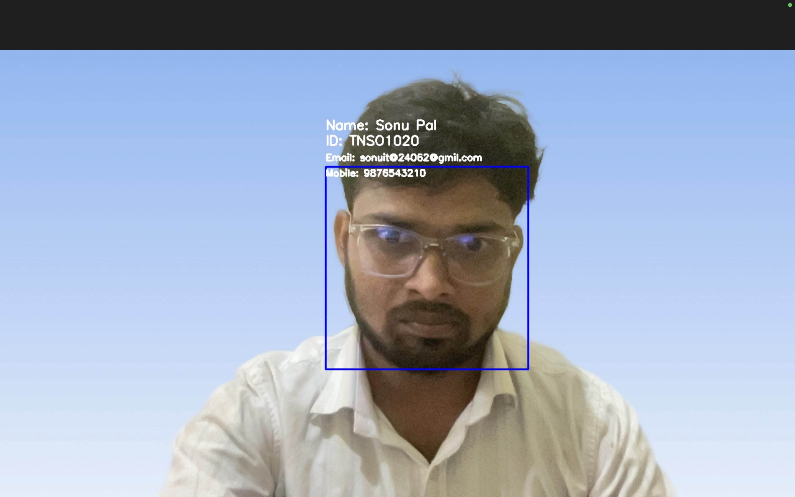

# 🎓 AI-Based Smart Attendance Monitoring System

An AI-powered Smart Attendance Monitoring System developed using **Python, OpenCV, Face Recognition, QR Code, Tkinter, and Excel** to automate student registration and attendance management.

---

## 📌 Project Overview

This project is designed to automate the attendance process using Artificial Intelligence and Computer Vision. Instead of taking attendance manually, the system recognizes students through their faces and records attendance automatically.

The project includes student registration, automatic student ID generation, QR code generation, face dataset collection, model training, face recognition, and attendance management.

---

## ✨ Features

- 👤 Student Registration
- 🆔 Automatic Student ID Generation
- 📱 QR Code Generation
- 📷 Face Dataset Collection
- 🧠 Face Recognition Training
- ✅ Automatic Attendance Marking
- 📊 Attendance Stored in Excel
- 🖥️ User-Friendly Tkinter GUI
- 💾 Student Database Management

---

## 🛠️ Technologies Used

- Python 3.13
- OpenCV
- Tkinter
- NumPy
- Pandas
- Pillow
- xlrd
- xlwt
- xlutils
- OpenPyXL
- PyQRCode
- Haar Cascade Classifier

## 📸 Project Screenshots

### Dashboard

###  Register Student

### Student Registered

###  Dataset Collection

### Face Recognition

###  Attendence Report

---

## 👨‍💻 Developer

**Sonu Pal**

B.Tech in Information Technology

Python | OpenCV | Artificial Intelligence | Machine Learning

---

⭐ If you like this project, don't forget to star this repository.

